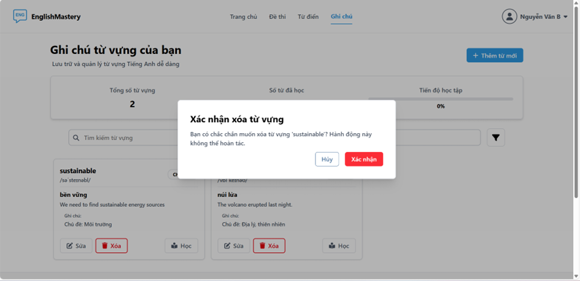
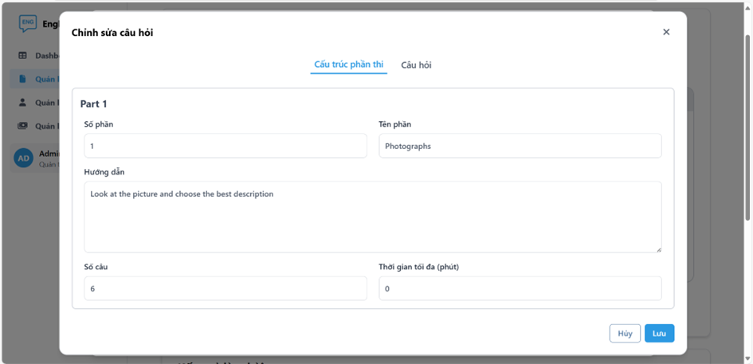

# 🧠 English Mastery - Hệ thống học tiếng Anh trực tuyến

Một ứng dụng web học tiếng Anh toàn diện được xây dựng với **React + Vite**, cung cấp các công cụ học tập hiệu quả cho người học và hệ thống quản lý mạnh mẽ cho quản trị viên.

> 🔧 Lưu ý: Dự án này chỉ bao gồm phần **Frontend**. Phần Backend được phát triển độc lập và cung cấp các API để frontend giao tiếp.

---

## 🚀 Tính năng chính

### 👩‍🎓 Dành cho người học (User)
- 📚 **Tra cứu từ điển**: Tìm kiếm nghĩa, phát âm và ví dụ của từ vựng
- 💰 **Đăng ký gói học**: Lựa chọn và thanh toán các gói học phù hợp
- 📝 **Quản lý từ vựng**: Lưu trữ và ôn tập từ vựng cá nhân
- 🔒 **Quản lý tài khoản**: Đổi mật khẩu và cập nhật thông tin cá nhân
- 📊 **Làm bài thi**: Làm các bài kiểm tra theo định dạng TOEIC
- 📈 **Lịch sử bài thi**: Xem lại kết quả và tiến độ học tập

### 🛠️ Dành cho quản trị viên (Admin)
- 📋 **Quản lý đề thi**: Tạo, chỉnh sửa và quản lý đề thi cùng các câu hỏi
- 📊 **Thống kê**: Báo cáo chi tiết về hoạt động học tập và doanh thu
- 👥 **Quản lý người dùng**: theo dõi hoạt động người dùng
- 💳 **Quản lý giao dịch**: Theo dõi và xử lý các giao dịch thanh toán

---

## 🛠️ Công nghệ sử dụng

| Layer        | Tech Stack                          |
|--------------|--------------------------------------|
| Frontend     | React 19, Vite                       |
| Styling      | Tailwind CSS                         |
| State        | Redux Toolkit                        |
| Routing      | React Router                         |
| HTTP Client  | Axios (interceptor + refresh token)  |
| Auth         | JWT-based Authentication             |
| Build Tool   | Vite + HMR                           |

---

## 🌐 Kiến trúc tổng quan

Ứng dụng frontend giao tiếp với hệ thống backend thông qua các API REST. Backend được triển khai riêng biệt bởi thành viên khác trong dự án.

---

## 🧪 Hướng dẫn cài đặt

### 🔧 Yêu cầu:
- Node.js >= 18.x
- npm

### ⚙️ Cài đặt:
```bash
# Clone repo
git clone https://github.com/Tu08112003/english-mastery.git
cd english-mastery

# Cài dependencies
npm install

# Chạy dev
npm run dev
```
---
## 🏗️ Cấu trúc dự án:

```
src/
├── components/          # Các component tái sử dụng
├── layout/              #  Giao diện khung chính
├── pages/              # Các trang chính của ứng dụng
├── plugins/            # icon sử dụng
├── redux/              # # Store, slice
├── routers/            # Định tuyến React Router
├── services/           # API services
├── utils/              # Hàm tiện ích
├── App.jsx           
```
---
## 📷 Demo
### Giao diện người học
- Trang chủ


---
- Chức năng đăng nhập, đăng ký


---
- Chức năng tra cứu từ điển


---
- Chức năng làm đề thi


---
- Chức năng quản lý từ vựng





---
- Chức năng xem lịch sử làm bài


---
- Chức năng đăng ký gói học


---
### Giao diện Admin
- Chức năng thống kê


---
- Chức năng quản lý đề thi




---
- Chức năng quản lý người dùng


---
- Chức năng quản lý giao dịch

---
## 🤝 Đóng góp

### Chúng tôi luôn chào đón đóng góp từ cộng đồng!

```bash
1. Fork project
2. Tạo nhánh mới: git checkout -b feature/ten-tinh-nang
3. Commit thay đổi: git commit -m 'feat: them tinh nang moi'
4. Push lên: git push origin feature/ten-tinh-nang
5. Tạo Pull Request

```

---
## 📬 Liên hệ
- 📧 Email: huynhtu012023@gmail.com
- 🔗 GitHub: @Tu08112003
